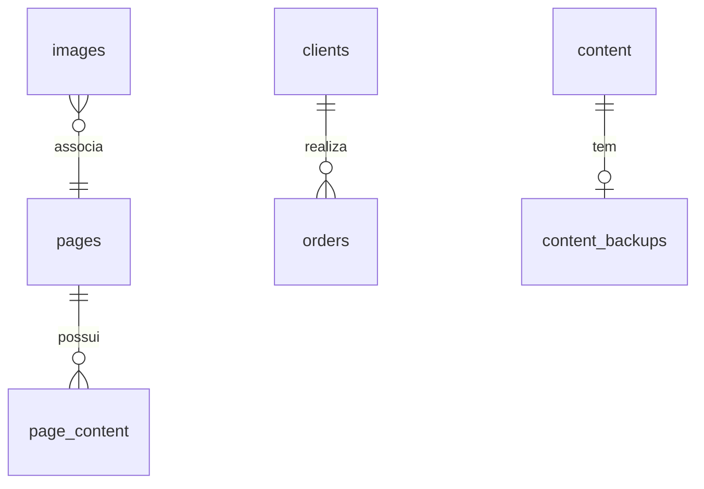

# RESUMO: Web Studio CMS (Arquitetura e Guia de Replicação React + Vite)

Este documento detalha o funcionamento, arquitetura e fluxo técnico do **Web Studio CMS**, fornecendo um guia completo para sua adaptação e replicação em uma estrutura de SPA baseada em **React + Vite**.

---

## 📊 1. Visão Geral do Sistema e Stack Tecnológica

O Web Studio CMS é um sistema monolítico modular ("Plug-and-Play") focado no desenvolvimento rápido e na edição dinâmica de landing pages, sites institucionais e lojas virtuais (E-commerce).

*   **Framework original:** Next.js (App Router)
*   **Linguagem:** TypeScript
*   **Interface e Estilo:** React 19, Tailwind CSS 4, Lucide React
*   **Banco de Dados:** SQLite (Local) / Turso DB (Produção) via client SQL puro (`@libsql/client`), sem uso de ORMs como Prisma ou Drizzle.
*   **Integrações Externas:** Mercado Pago (Checkout Pro e Webhook), Correios (Cálculo de frete e prazos), EmailJS (E-mails de recuperação de senha).

---

## 🏗️ 2. Arquitetura de Software e Banco de Dados

O banco de dados é autogerenciado e as migrações/criações das tabelas são executadas programaticamente durante a inicialização na função `initDb()` em `lib/db.ts`.

### 2.1. Modelagem do Banco de Dados
Abaixo estão as tabelas principais mapeadas na plataforma:



*   **`content`**: Armazena as chaves de configuração globais e os dados da página inicial (Key-Value Store).
*   **`pages`**: Árvore de páginas dinâmicas contendo `slug`, `title`, `show_in_menu`, `parent_slug` e `menu_order`.
*   **`page_content`**: Conteúdo personalizado por slug de página (`page_slug`, `key`, `value`).
*   **`users`**: Login e controle administrativo (`username`, `password_hash`).
*   **`images` & `files`**: Armazenamento em Base64 de imagens e arquivos digitais, indexados por tipo de componente.
*   **`content_backups`**: Histórico granular contendo as 6 versões de segurança mais recentes por seção.
*   **`clients` & `orders`**: Clientes (com campos adicionais para recuperação de senha: `reset_token`, `reset_token_expires`) e controle de transações financeiras.
*   **`contact_messages`**: Caixa de entrada das mensagens persistidas do formulário de contato.

---

## 🔌 3. Componentes Modulares e o Motor "Plug-and-Play"

### 3.1. Estrutura Tríade Obrigatória
Qualquer componente visual adicionado ao CMS fica em `app/sections/` em uma subpasta com exatamente 3 arquivos:

```text
app/sections/MeuComponente/
├── schema.ts   (Definição de chaves e controle de visibilidade)
├── index.tsx   (Componente público visível ao usuário final)
└── admin.tsx   (Painel administrativo de configuração)
```

### 3.2. Mecanismo de Autodescoberta
O script `scripts/generate-registry.js` é executado nos hooks de build-time (`npm run predev` / `npm run build`). Ele lê as pastas de componentes e gera automaticamente o arquivo `app/sections/registry.ts`. Esse arquivo exporta um mapa estático contendo os schemas, componentes de frontend e painéis administrativos mapeados pelo título único do componente.

### 3.3. Mecanismo de Isolamento via Proxies (Multi-Instanciamento)
Quando um administrador duplica ou clona uma seção na mesma página, o CMS gera um identificador único de instância (ex: `inst_abc123`).
*   **No Banco de Dados:** O CMS persiste as chaves do componente prefixadas: `inst_abc123_meu_titulo`.
*   **No Frontend (`PageBuilder.tsx`):** O objeto de dados é encapsulado em um `Proxy` JavaScript.
*   ```typescript
    const content = new Proxy(rawContent, {
      get(target, prop) {
        if (typeof prop === 'string') {
          const prefixedKey = instance.id ? `${instance.id}_${prop}` : prop;
          return target[prefixedKey] !== undefined ? target[prefixedKey] : target[prop];
        }
        return (target as any)[prop];
      }
    });
    ```
*   **Transparência:** O desenvolvedor escreve o código do componente (`index.tsx`) consumindo `content.meu_titulo`. O proxy se encarrega de ler a versão isolada (`inst_abc123_meu_titulo`) ou, caso ela não exista, recuar para a chave padrão global (`meu_titulo`).

---

## 🎨 4. Regras de Desenvolvimento de Seções (Diretrizes do Admin)

Ao criar ou estender componentes, as seguintes boas práticas são obrigatórias:

*   **Padrão List-View + Modal (Para listas de itens repetíveis):** Componentes que possuem `listKey` em seu schema devem mostrar uma lista resumida de itens (usando `stripHtml` e thumbnails) e permitir a edição individual por meio de um modal overlay controlado pelas props `editingItemId` e `setEditingItemId`. Nunca utilize formulários inline gigantes.
*   **Uso Direto de `handleUpdateListItem`:** Para atualizar propriedades em listas, passe os valores diretamente ao handler fornecido sem duplicar estados locais adicionais.
*   **Sanitização de HTML:** Use sempre a tag `<SafeHTML html={content.campo} fallback="..." />` no frontend.
*   **JSON Seguro:** Utilize `try-catch` com fallback para arrays vazios (`[]`) em todas as operações de parsing do banco.
*   **Estilização por Variáveis CSS:** No `index.tsx`, estilize classes através de variáveis de tema (ex: `text-[var(--text-primary)]`, `bg-[var(--background)]`, `border-[var(--border)]`). Não utilize classes estáticas como `bg-white` ou `border-gray-200` para garantir que o tema mude reativamente com o painel de Estilização Visual.
*   **Mapeamento de Mídias (Imagens/Arquivos):**
    *   *Campos simples:* `openImageLibrary('campo', 'tipo_componente')` (2 parâmetros).
    *   *Itens de lista:* `openImageLibrary(item.image_url, 'tipo_componente', section.listKey!, item.id, 'image_url')` (5 parâmetros).

---

## 🛍️ 5. Integrações e Serviços Externos

1.  **Mercado Pago (E-commerce):** O checkout calcula o valor final da compra e gera uma URL segura de pagamento. O status do pedido é sincronizado de forma assíncrona por meio do webhook `/api/webhook`, que localiza o pedido a partir do `external_reference` gerado na transação.
2.  **EmailJS (Recuperação de Senha):** Um fluxo seguro gera tokens expiráveis e envia e-mails transacionais. Caso as credenciais não estejam configuradas em `.env`, o sistema entra em **Modo Demo**, exibindo o link de recuperação diretamente no painel do console.
3.  **Correios (Logística):** Cálculo de frete e prazos reativo integrado diretamente no processo de finalização de compra.

---

## ⚡ 6. Guia de Replicação em React + Vite

Para replicar esta mesma arquitetura em um projeto **React + Vite** (que por padrão é cliente puro, sem servidor integrado), siga os seguintes passos de adaptação:

### 📂 Passo 1: Descobrimento Dinâmico de Componentes (Sem Scripts)
Em vez de depender do script Node `generate-registry.js` para reescrever arquivos em build-time, use o recurso nativo de importação dinâmica do Vite (`import.meta.glob`).

Crie o arquivo `registry.ts` com a seguinte lógica:

```typescript
import { ModularSection } from './types';

// Escaneia a pasta de seções em tempo de compilação de forma gulosa (eager)
const schemas = import.meta.glob('./sections/*/schema.ts', { eager: true });
const components = import.meta.glob('./sections/*/index.tsx', { eager: true });
const admins = import.meta.glob('./sections/*/admin.tsx', { eager: true });

export const modularSections: Record<string, ModularSection> = {};

Object.keys(schemas).forEach((path) => {
  const schemaModule = schemas[path] as any;
  const schema = Object.values(schemaModule)[0] as any;

  // Substitui os caminhos para localizar os componentes irmãos correspondentes
  const componentPath = path.replace('schema.ts', 'index.tsx');
  const adminPath = path.replace('schema.ts', 'admin.tsx');

  const Component = (components[componentPath] as any)?.default;
  const Admin = (admins[adminPath] as any)?.default;

  if (schema && Component && Admin) {
    modularSections[schema.title] = {
      schema,
      Component,
      Admin
    };
  }
});

export const getModularSection = (title: string) => {
  const baseTitle = title.split('#')[0];
  return modularSections[baseTitle];
};
```

### ⚙️ Passo 2: Implementando o Backend do CMS
Como o Vite é puramente do lado do cliente, as rotas `/api/*` e a lógica do banco de dados em `lib/db.ts` devem ser transferidas para um servidor Node externo (Express, Fastify, NestJS) ou uma infraestrutura Serverless (Vercel Functions, Supabase Edge Functions):
1.  **Endpoints CRUD**: Replique as rotas de atualização de chaves, gerenciamento de páginas dinâmicas, criação de backups e consultas de histórico.
2.  **Autenticação**: Crie um middleware de validação JWT ou Session Cookies para validar requisições administrativas para as rotas administrativas e uploads.
3.  **Endpoint de Upload de Imagem**: Crie um serviço que processe uploads binários, converta para Base64 e persista na tabela `images` do Turso DB ou integre com um serviço de nuvem (S3/Cloudinary/Supabase Storage) retornando a URL correspondente.
4.  **Mapeamento de Rotas da API**: No React, utilize bibliotecas como Axios ou TanStack Query (React Query) configurando um `baseURL` (ex: `http://localhost:5000/api`) para efetuar as requisições.

### 🔀 Passo 3: Roteamento no Cliente (Wildcard / Catch-All Route)
Para substituir a pasta `[slug]` do Next.js App Router, instale o `react-router-dom` e configure uma rota catch-all que renderize dinamicamente as páginas salvas:

```tsx
import { BrowserRouter, Routes, Route } from 'react-router-dom';
import DynamicPage from './pages/DynamicPage';
import AdminDashboard from './pages/AdminDashboard';
import Login from './pages/Login';

export default function App() {
  return (
    <BrowserRouter>
      <Routes>
        <Route path="/admin/*" element={<AdminDashboard />} />
        <Route path="/conta/login" element={<Login />} />
        {/* Captura todas as outras rotas para tratar como slugs dinâmicos */}
        <Route path="/:slug" element={<DynamicPage />} />
        <Route path="/" element={<DynamicPage />} />
      </Routes>
    </BrowserRouter>
  );
}
```

No componente `DynamicPage`, capture o slug da URL (`useParams()`), consulte seu backend para receber as configurações da página e o conteúdo e passe os parâmetros para o componente `<PageBuilder content={pageContent} />`.

### 🔄 Passo 4: O Proxy de Conteúdo (Reutilização Direta)
O motor de proxies utilizado no `PageBuilder.tsx` é Javascript puro e é **100% compatível** com o Vite sem nenhuma alteração. Você pode copiar o componente `PageBuilder.tsx` diretamente para a sua base de dados do Vite!

### 🎨 Passo 5: Gerador de Estilos Dinâmicos (DynamicStyles)
No React + Vite, a injeção reativa de fontes e cores do tema (DynamicStyles) pode ser implementada inserindo uma tag `<style>` no corpo do HTML principal dinamicamente ou alterando as variáveis CSS no elemento `:root` via código JS no cliente:

```typescript
useEffect(() => {
  if (content) {
    const root = document.documentElement;
    root.style.setProperty('--background', content.color_background || '#000');
    root.style.setProperty('--text-primary', content.color_text_primary || '#fff');
    root.style.setProperty('--primary', content.color_primary || '#6366f1');
    // Adicione os demais tokens de design...
  }
}, [content]);
```